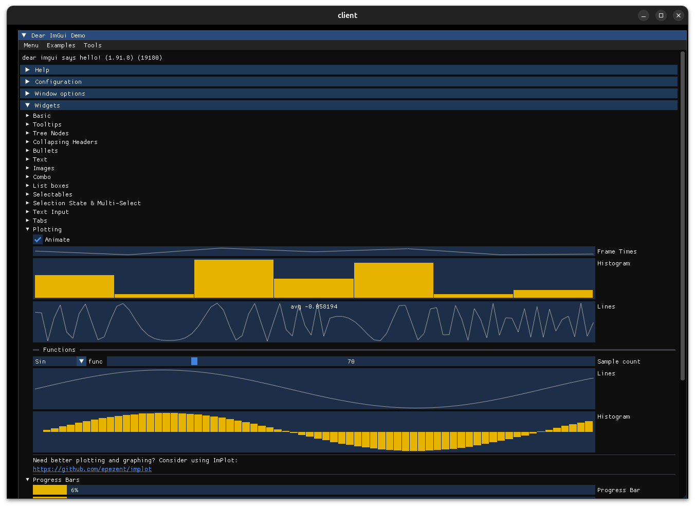

# cimgui Reference

Minimal reference Makefile to clone and build cimgui with a GLFW + OpenGL backend from source.
Includes a minimal executable to open the cimgui demo window using Zig 0.14.1 code.

## Build and Run

`make`
